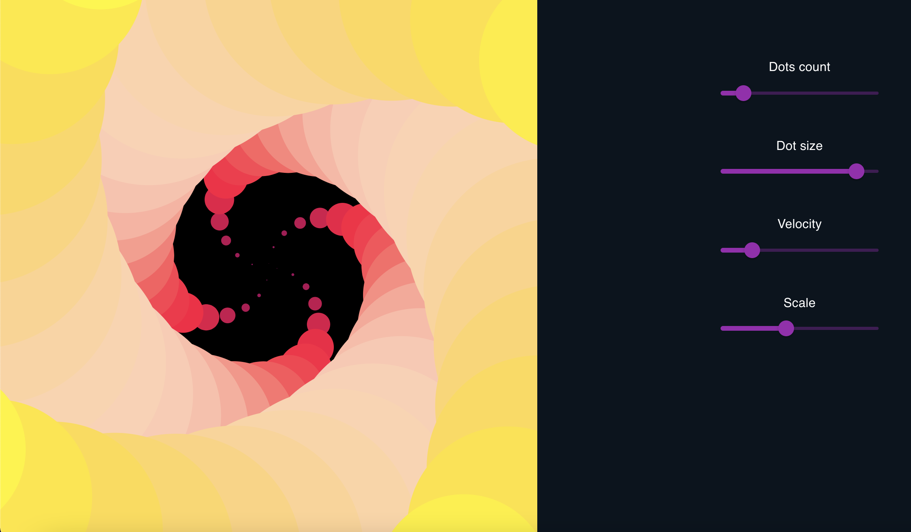

<h1> P5-Interactive </h1>

Some P5.js canvas with controls purely on aesthetic purpose

Demo: https://p5-interactive.vercel.app/hello


<h2> Screenshots: </h2>




<h2> To run locally: </h2>
 
```
git clone https://github.com/RAILRAIL/p5-interactive
```
```
npm install
```
```
npm start
```

